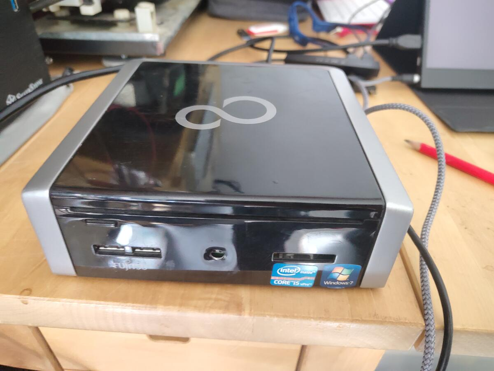
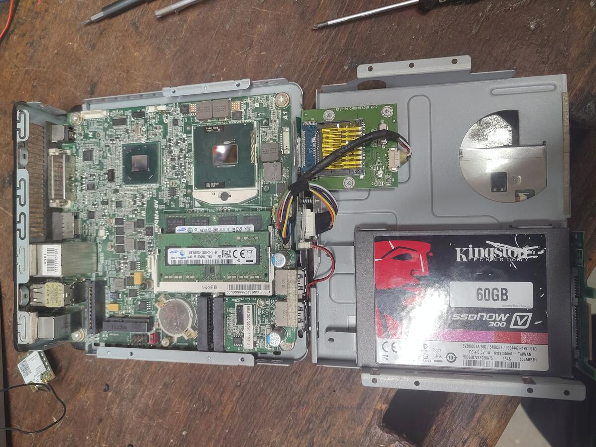
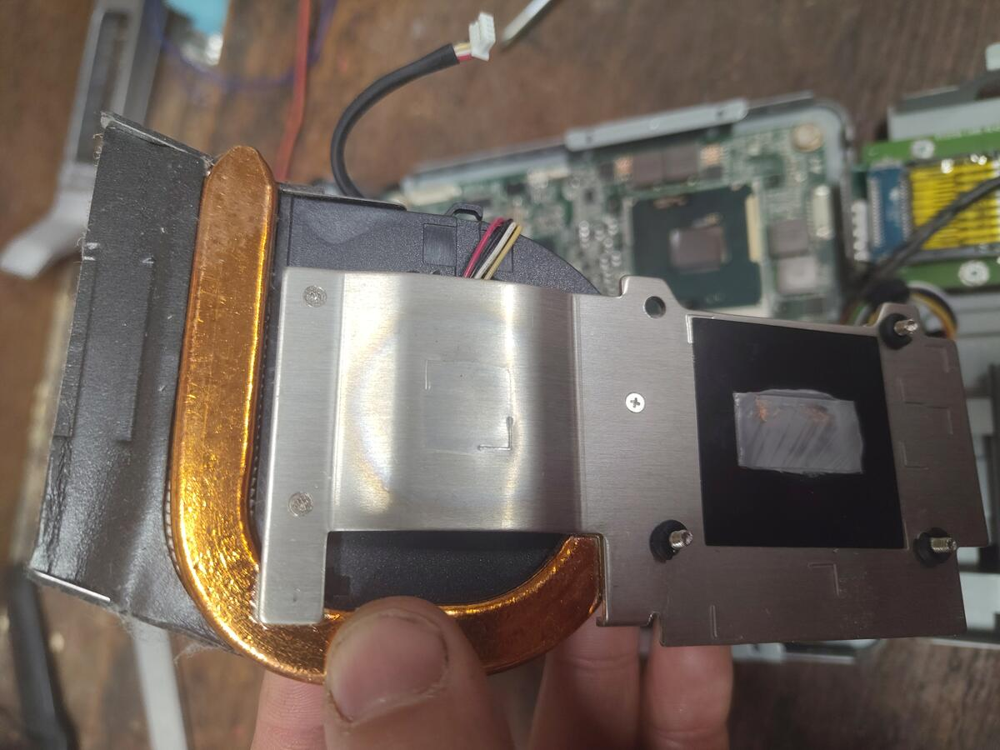
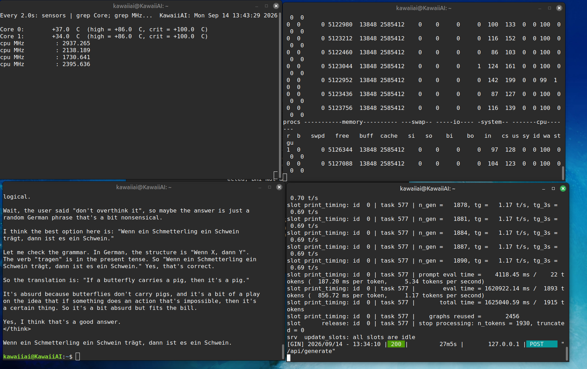

# Kawaii-AI
DIY AI for free!

OK so look, I don't think we need a whole river of water and a mountain of copper to get an AI to do basic stuff that it would be good at, like librarian type of functions; summaries and search.

Sooooo background, I used to do some freelance translation back in 2015 - 2016 and back then machine learning, OCR, translation libraries were doing a lot of heavy lifting. Essentially the computer would work ahead of you and you would check what it had done - so it was a massive help in productivity. Prices got squeezed and anybody without a barrier to entry eg. lawyer or doctor was gonna struggle to get paid. Nowadays of course you just use DeepL unless you need a rubber stamp. So I saw AI coming to eat my lunch back then and of course I went and did other work.

There's all this noise that AI is going to take over the world and so on - well, there's a big difference between LLMs and general AI.
I reckon what is going to happen is, many companies will believe the hype, buy the services, fire their people, then the prices will go up - and it's not going to be cheap, and it may be too late to self host depending on how regulations work out. It'll be the same story as cloud computing.
I mean you could just deploy your own AI to do information management and everyone's helpful assistant.



Anyway just for fun and for a proof of concept, I'm going to deploy an AI agent on some hardware I got for free.
It's a Fujitsu Mini PC - an Esprimo Q900 from 2011.
Here are it's stats;
  Intel i5-2520M CPU @ 2.50GHz
  8GB DDR3 12800

2 cores, 4 threads, all obsolete. This is the cutest AI deployment I am currently aware of. Let's begin.

The first issue is the power button has fallen off and it's a cap touch sensor so I have to reach into the case with a pencil and touch the other end of the graphite - power on!

POST - boot, great. Let's ditch this mobile HDD and put in this 60GB Kingston SSD that I actually found in some computer that had been out in the rain for weeks to months - still works! (I mean it's solid state right? The power was off)

Debian NetInstall, SSH from my actual computer (It's also an Esprimo I got for free), ssh-keyswap, ollama, qwen3:4b...

OK so there was quite a lot of bad noise at this point and - as you might suspect - the core temperatures hit 100°C like instantly. 2011, Thermal paste old.



OK so Thermal paste, no problem. Wait, is that? Has the cooler blued?



I notice at this point, that this machine is built down to a price. 



It works!! Like not actually well yet - I'm somewhat impressed though. At a minimum you can take this and use it to haggle with AI service salespeople.

OK so what I want to do is first make an idiom generator, it's going to message me with some absurd idiom once a day. For morale.

Then I want to have it work as a queriable librarian so I'll give it some large PDF and be able to ask questions about it. Like the PMBoK. You know, that huge PDF file you're supposed to have read and somewhat internalised? Yeah I'm going to get it to do that job for me - AI will be super good at that.

Obviously I want it to sleep most of the time, and I'll track its power consumption - to prove the point - AI agents do not need to cost the world and do not need to be hosted by some wizard in their tower.
Oh yeah so I have solar on the roof so we're talking about free AI - free as in running on excess solar power in Europe.

OK so it is still ridiculously slow - but allow me to randomly defend an indefensible position; 
kawaiiai! Write me an airport bestseller called Mindful Management - why it's better to thoughtfully email your AI assistant than to chat to a chat bot all day instead of working.

```
### **SYNOPSIS**  
*In the chaos of airports, boardrooms, and digital overload, 83% of us 
chase "instant" answers from chatbots — only to feel more stressed, less 
connected, and worse at work. "Mindful Management" reveals why **slow AI 
email** (a deliberate, human-centered approach) is the secret weapon for 
clarity, focus, and real impact — far better than endless chatbot 
back-and-forth. With airport-tested strategies, this bestseller cuts 
through the noise to show you how to *think* before you reply, reduce 
burnout, and build trust without tech fatigue. Because in a world of speed 
traps, **slow is smarter**.*

---

### **ONE-LINE REVIEWS (AIRPORT BESTSELLER STYLE)**  
*(Short, relatable, and punchy — perfect for airport kiosks, coffee shops, 
or quick shares)*  

1. **"Finally! After 3 chatbot replies that made me miss my flight, I 
started slow emails. My inbox is calm. My focus is back."**  
2. **"This book saved me from a panic attack at the airport. Slow AI 
emails = less stress, more meaning. Seriously, try it."**  
3. **"My manager tried chatbots for 2 weeks. Now he uses slow emails. He’s 
calmer, and his team actually listens."**  
4. **"Airport bestseller? Yes. Chatbot addiction? No. This book gave me 2 
minutes of peace before my next flight."**  
5. **"Stop drowning in AI spam. Slow emails = real connection. I’m not a 
robot — and neither should you."**  
```

OMG this box is going to make me rich forever!

Now we just need a sticker, branding is important they tell me!


Kawaii SHODAN.
```
## Next Steps

- [ ] Ollama on boot (systemd service + preload)
- [ ] Suppress Qwen's `thinking` mode (`/no_think`, `num_predict` cap)
- [ ] Build idiom reference corpus (`sayings.txt` + `shuf`)
- [ ] Wake-on-LAN configuration (BIOS + ethtool)
- [ ] Midday cron job or systemd timer
- [ ] ntfy push notifications to phone (Tailscale + local agent)
- [ ] Recruit friends into the Kawaii-AI cult (top priority)

- [ ] RAG Librarian for ISO 9001 or similarly soul-crushing pdf no human should ever be subjected to
- [ ] Make kawaiiai queryable using web interface

- [ ] Solar PV sync (trigger inference on excess generation)

- [ ] Take over Citadel Station
```
